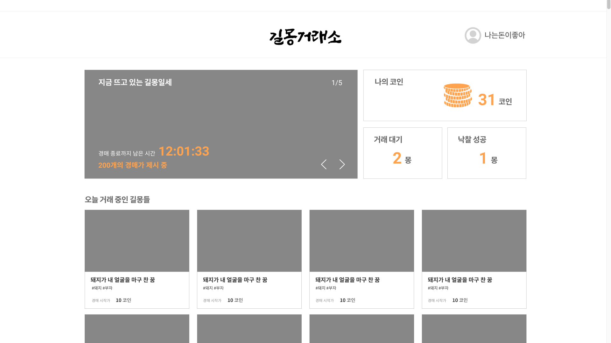

<p align="center">
  
  <p align="center" style="font-size: 30px; font-weight: 300">길몽 거래소</p>
</p>

<h2 align="center">
  <a href=""></a>
</h2>

<br />

## 프로젝트 소개

🌐 **이용자들이 자신의 꿈을 가벼운 그림과 함께 업로드하면, 꿈이 경매에 올라 최고가 낙찰을 받고 거래되는 웹 서비스입니다.**

> PROJECT PERIOD: 2021.05.22 ~ 2021.05.23

<br />

## ✨ 주요 기능

### 🧔 메인



💡 메인 기능

- 오늘의 인기 꿈
- 꿈 판매하기
- 나의 코인
- 구매자의 거래 대기 건수
- 구매자의 낙찰 성공 건수
- 거래가 진행중인 길몽

<br />

## 🗂 프로젝트 구조

```
public
 ┗ index.html
src
 ┣ assets
 ┃ ┣ icons
 ┃ ┃ ┣
 ┃ ┃ ┣
 ┃ ┃ ┗
 ┃ ┗ img
 ┃ ┃ ┣
 ┃ ┃ ┣
 ┃ ┃ ┗
 ┣ components
 ┃ ┣ common
 ┃ ┣ detail
 ┃ ┣ main
 ┃ ┣ mypage
 ┃ ┗ upload
 ┣ lib
 ┃ ┗ api.js
 ┣ pages
 ┃ ┣ DetailPage.js
 ┃ ┣ MainPage.js
 ┃ ┣ UploadPage.js
 ┃ ┗ MyPage.js
 ┣ App.js
 ┣ index.css
 ┗ index.js
```

<br />

## 🛠 사용 기술

| Front-End                    | Back-End              | DataBase | Front-Server | Back-Server | Tool                   |
| ---------------------------- | --------------------- | -------- | ------------ | ----------- | ---------------------- |
| JavaScript<br>React<br>Axios | JavaScript<br>Node.js |          | Vercel       | AWS EC2     | Git<br>Figma<br>Notion |

```
"@testing-library/jest-dom": "^5.11.4",
"@testing-library/react": "^11.1.0",
"@testing-library/user-event": "^12.1.10",
"axios": "^0.21.0",
"node-sass": "4",
"react": "^17.0.1",
"react-dom": "^17.0.1",
"react-router-dom": "^5.2.0",
"react-scripts": "4.0.0",
"web-vitals": "^0.2.4",
"styled-components": "^5.2.1"
```

<br />

## 🖥 Local 실행 방법

#### [1] npm 설치

[npm 설치 바로가기](https://docs.npmjs.com/cli/v7/commands/npm-install)

#### [2] Clone the Repo

```sh
git clone https://github.com/SOPT-KLP/gilmong-client.git
```

#### [3] Install Packages

```sh
npm i
```

#### [4] Run the Project

```sh
npm start
```

<br />

## 💻 개발자

|  이름  |                             사진                             |         주소         |
| :----: | :----------------------------------------------------------: | :------------------: |
| 김소령 |  | github.com/soryeong  |
| 나정현 |  | github.com/leahincom |
| 박찬순 |  |  github.com/soonnie  |

<br />

### :link: URL

- [길몽거래소 바로가기(개발 전-노션)](https://www.notion.so/26dfaa4ff43e4be3a32184e700a9f84c)
